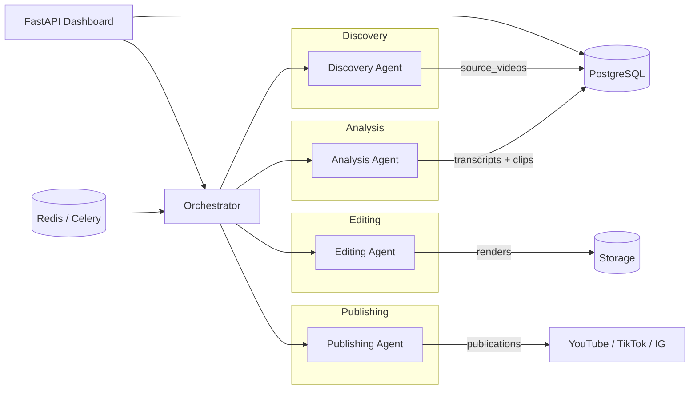

# Shorts Pipeline

Pipeline multi-agents automatisé : **YouTube long-form → shorts verticaux 9:16 sous-titrés → publication** sur TikTok, YouTube Shorts et Instagram Reels.

## Architecture



| Agent | Rôle |
|-------|------|
| **Discovery** | Cherche des vidéos pertinentes (whitelist / Creative Commons uniquement) |
| **Analysis** | Télécharge, transcrit (Whisper), détecte les meilleurs moments (LLM) |
| **Editing** | Découpe 9:16, sous-titres ASS, audio, miniature |
| **Publishing** | Upload multi-plateforme avec scheduler et idempotence |
| **Orchestrator** | Machine à états, file Celery, retries, dead-letter |

## Stack

- Python 3.11+ (`uv`)
- FastAPI + Celery + Redis
- PostgreSQL + SQLAlchemy 2.0 + Alembic
- Docker Compose (api, workers, redis, postgres, flower)
- structlog + Prometheus metrics
- Tests : pytest / ruff / mypy strict

## Démarrage rapide (Docker)

```bash
cp .env.example .env
# Renseigner au minimum SECRET_KEY et FERNET_KEY
uv run shorts-pipeline gen-fernet-key   # coller dans FERNET_KEY

docker compose up --build
```

- API / dashboard : http://localhost:8742  
- Flower : http://localhost:5555  
- Docs OpenAPI : http://localhost:8742/docs  

`DRY_RUN=true` (défaut) exécute le pipeline **sans publier**.

## Développement local

```bash
# Prérequis : Python 3.11+, uv, ffmpeg ; Postgres + Redis (ou docker compose up postgres redis)
curl -LsSf https://astral.sh/uv/install.sh | sh
cp .env.example .env

uv sync --all-extras
uv run alembic upgrade head
uv run shorts-pipeline serve          # API sur :8742
uv run celery -A shorts_pipeline.workers.celery_app.celery_app worker -Q orchestrator -l INFO
```

### Qualité

```bash
uv run ruff check src tests
uv run ruff format src tests
uv run mypy src
uv run pytest -q
pre-commit install
```

## Configuration des clés API

| Variable | Usage |
|----------|--------|
| `YOUTUBE_API_KEY` | YouTube Data API v3 (discovery + quota) |
| `YOUTUBE_OAUTH_CLIENT_ID` / `_SECRET` | Upload YouTube Shorts |
| `ANTHROPIC_API_KEY` | Détection de moments (Claude) |
| `TIKTOK_CLIENT_KEY` / `_SECRET` | TikTok Content Posting API |
| `META_APP_ID` / `META_APP_SECRET` | Instagram Reels (Graph API) |
| `FERNET_KEY` | Chiffrement des tokens OAuth en base |
| `ALERT_DISCORD_WEBHOOK_URL` / Telegram | Alertes dead-letter |

Voir `.env.example` pour la liste complète.

### Licence / droits

Le Discovery Agent **ne retient que** :

1. Les chaînes présentes dans `channels_whitelist` (vos chaînes / autorisées), **ou**
2. Les vidéos sous licence **Creative Commons**

Chaque ligne `source_videos` stocke `license_basis` (`whitelist` | `creative_commons`).

Niches / mots-clés : `config/niches.yaml`. Styles de sous-titres : `config/styles/`.

## Modèle de données

`channels_whitelist` → `source_videos` → `transcripts` / `clips` → `renders` → `publications`  
+ `accounts`, `jobs_log`, `style_templates`

Statuts vidéo : `discovered → downloaded → transcribed → analyzed → …`  
Statuts clip : `analyzed → rendered → awaiting_review → scheduled → published | failed`

## Services Compose

| Service | Rôle |
|---------|------|
| `api` | FastAPI + migrations Alembic au démarrage |
| `worker-discovery` | Queue `discovery` |
| `worker-analysis` | Queue `analysis` |
| `worker-editing` | Queue `editing` |
| `worker-publishing` | Queues `publishing` + `orchestrator` |
| `redis` / `postgres` | Broker + état |
| `flower` | Monitoring Celery |

Stockage fichiers : volume `/data/shorts` derrière l’interface `StorageBackend` (local aujourd’hui, S3/MinIO plus tard).

## Roadmap d’implémentation

1. ✅ Squelette, Docker, config, DB, logging, CI  
2. ✅ Orchestrator + Celery + agent factice  
3. ✅ Discovery Agent (licence + score + dédup)  
4. ✅ Analysis Agent (yt-dlp, Whisper, LLM)  
5. ✅ Editing Agent (9:16, ASS, loudnorm)  
6. Publishing Agent  
7. Dashboard + review + notifications  
8. Durcissement / monitoring / doc finale  

### Contrôle pipeline (Phase 2)

```bash
# Smoke sync (agents factices, DRY_RUN)
curl -X POST http://localhost:8742/api/pipeline/dummy-e2e

# Pause / resume un agent
curl -X POST http://localhost:8742/api/pipeline/agents/pause \
  -H 'Content-Type: application/json' -d '{"agent":"discovery"}'
```

Décisions d’architecture : [`DECISIONS.md`](DECISIONS.md).
